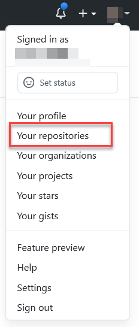
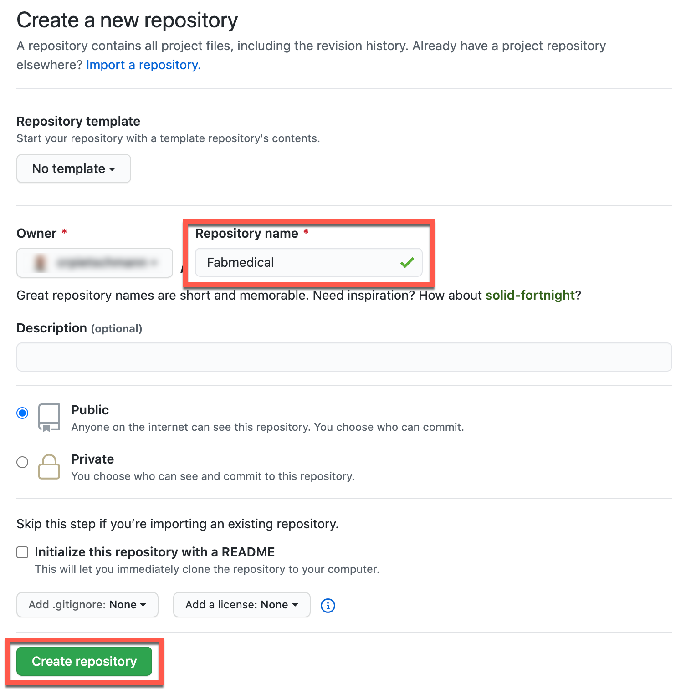

### Preparation
This describes the steps that can be performed before the hands on labs start.

### Create a GitHub repository

1. Open a web browser and navigate to <https://www.github.com>. Log in using your GitHub account credentials.

2. In the upper-right corner, expand the user drop down menu and select **Your repositories**.

    

3. Next to the search criteria, locate and select the **New** button.

    

4. On the **Create a new repository** screen, name the repository **Fabmedical** and select the **Create repository** button.

    

5. Personal access token
    > **Note**: If you have multi-factor authentication, you will need to create a personal access token when using the cloud shell. Reference the following link for help with setting up a GitHub personal access token to use for authenticating `git` with your GitHub account: <https://docs.github.com/en/github/authenticating-to-github/creating-a-personal-access-token>.

    > **Note**: Once you have your personal access token, retry the above command, use your token as the password.
